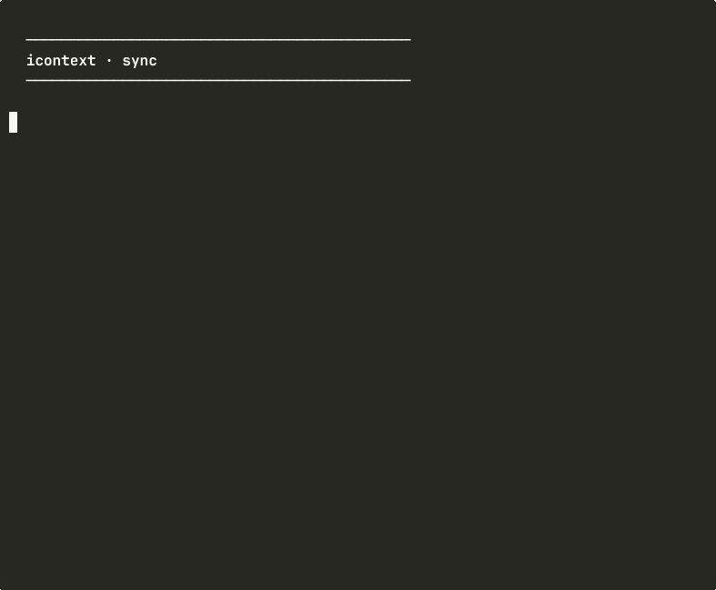

# icontext

[](https://github.com/floomhq/icontext/actions/workflows/ci.yml)
[](https://opensource.org/licenses/MIT)
[](https://www.python.org/downloads/)
[](https://github.com/floomhq/icontext/stargazers)



**Your AI agents now share a brain.**

icontext is a folder + a set of skills. Your AI tools (Claude Code, Cursor, Codex) read from it before answering, and write to it as they learn about you. Local. Encrypted. No API keys.

## Quickstart

```bash
curl -fsSL https://raw.githubusercontent.com/floomhq/icontext/main/get.sh | bash
icontext init
```

Open Claude Code and say: **"Populate my icontext profile."**

That's it. Your AI now has persistent memory.

## How it works

`icontext init` creates a vault at `~/context/` and installs three skills into Claude Code (and Cursor):

- **icontext-populate-profile** — your agent builds your profile from real data
- **icontext-refresh-profile** — keeps the profile current as things change
- **icontext-share-card** — generates a shareable one-pager

When you ask Claude to "populate my profile", it cascades through real sources to find the highest-quality data:

1. **Gmail** (via Gmail MCP) — last 90 days of subjects + senders, no message bodies
2. **LinkedIn** — browser scrape if available, otherwise read your LinkedIn PDF export
3. **You describe yourself** — 4 questions, only if neither of the above works

The synthesis happens inside your Claude Code session. No external API calls. No data leaves your machine.

## What you get

```text
~/context/
  shareable/        public-safe summaries
    profile/
      context-card.md   sendable to collaborators
  internal/         private working context
    profile/
      user.md           full profile
      relationships.md  key contacts
      projects.md       active projects
  vault/            git-crypt encrypted secrets
```

Then your agents share the same context layer:

```text
Claude Code   →  skills + CLAUDE.md
Cursor        →  rules
Codex / OpenCode  →  optional MCP server (legacy)
GitHub        →  gitleaks + tier CI
```

## Privacy

Synthesis runs inside your AI agent's session, not on a server. Default install requires no API keys. Email metadata never leaves your laptop.

icontext stores:

- Your synthesized profile in `~/context/internal/profile/`. Plaintext on disk. Use FileVault.
- Your vault secrets in `~/context/vault/`. Encrypted with `git-crypt`.

icontext does not run a server. No data is ever sent to any icontext-controlled endpoint.

Full threat model: see [SECURITY.md](SECURITY.md).

## Headless / no-agent setup (optional)

If you don't have Claude Code or Cursor and want a fully automated pipeline, the original Gemini-based sync is still available:

```bash
pip install icontext[sync]
icontext connect gmail
icontext connect linkedin --pdf ~/Downloads/Profile.pdf
icontext sync
```

This requires `GEMINI_API_KEY` and runs the same 3-stage synthesis as the agent skill, but headlessly. Use it for CI, scripts, or non-agent environments.

## Features

| Layer | What icontext does |
|---|---|
| Skills | Markdown instructions your agent follows to populate and refresh your profile. |
| Encryption | `vault/**` is protected with `git-crypt` in Git and on GitHub. |
| Secret scanning | `gitleaks` runs locally and in GitHub Actions. |
| Tier enforcement | deterministic classifier blocks sensitive files in lower-trust folders. |
| Retrieval | local SQLite FTS index, rebuilt by hook, no API key required. |
| MCP (optional) | `search_vault`, `read_vault_file`, `append_log`, `rebuild_index`. |
| Verification | `doctor.py --deep` checks hooks, encryption, index, MCP, agents, gitleaks, and CI. |
| Headless sync | optional Gemini-based fallback for CI / no-agent setups. |

## Tiers

A vault split into three top-level folders:

| Folder | Meaning | Encryption |
|---|---|---|
| `shareable/` | Could be published without harm | Plaintext |
| `internal/` | Personal/business but not catastrophic if leaked | Plaintext |
| `vault/` | Must never leak | git-crypt encrypted |

The classifier enforces content matches folder. Secrets are never allowed anywhere without git-crypt.

## Install

```bash
curl -fsSL https://raw.githubusercontent.com/floomhq/icontext/main/get.sh | bash
icontext init
```

Or manually:

```bash
git clone https://github.com/floomhq/icontext ~/icontext
pip install -e ~/icontext
icontext init
```

`icontext init` creates the vault, installs skills into `~/.claude/skills/` and `~/.cursor/rules/`, and adds a CLAUDE.md snippet so your agent loads the profile at session start.

### Skill management

```bash
icontext skills list      # show installed skills and where they live
icontext skills update    # pull latest skill versions from the icontext repo
```

## Prove it works

```bash
icontext doctor
```

The doctor command validates your install without starting background services or adding hosted dependencies.

## Uninstall

```bash
bash ~/icontext/uninstall.sh /path/to/vault
```

Uninstall removes icontext-managed hooks, `.icontext/`, the GitHub Actions workflow, and the install manifest. It leaves your `shareable/`, `internal/`, and `vault/` content in place.

## Requirements

- `git`
- Python 3.11+

Optional:

- `gitleaks` for secret scanning (`brew install gitleaks`)
- `git-crypt` for vault encryption (`brew install git-crypt`)
- `git-lfs` for binary assets (`brew install git-lfs`)
- `GEMINI_API_KEY` only if you want the headless `icontext sync` fallback

## How icontext compares

Common question: "isn't this just like X?"

| | What it is | How icontext is different |
|---|---|---|
| **mem0 / Letta / Zep** | Memory libraries for developers building agents | icontext is for end users; you don't write code to use it |
| **OpenMemory** | Local CLI + MCP for AI memory | OpenMemory's memory is reactive (built from chat history). icontext is proactive (built from your real data: Gmail, LinkedIn) |
| **Obsidian** | Knowledge base for humans | Obsidian is for humans writing notes; icontext is for AI agents writing context. Same folder works for both — open ~/context in Obsidian for the human view. |
| **Pieces.app** | OS-level capture for developers | Pieces captures what you do; icontext synthesizes who you are. Different layer. |
| **Claude Code's CLAUDE.md** | Per-project AI instructions | CLAUDE.md is per-project. icontext is your *identity* — the same context every project uses. |
| **Cursor Rules / .cursorrules** | Cursor-specific instructions | icontext works across Claude Code, Cursor, Codex, OpenCode via MCP and shared file conventions. Tool-agnostic. |

The wedge: **icontext is the only tool that proactively builds your professional identity from sources you already own (Gmail, LinkedIn) and exposes it to every AI tool you use.**

## Status

Production-ready. Run `icontext doctor` to verify your install.

> Social preview image at `assets/og-image.png` — upload via Settings → Social preview

## Built with icontext

*Share your setup: tag #icontext on Twitter/X*
